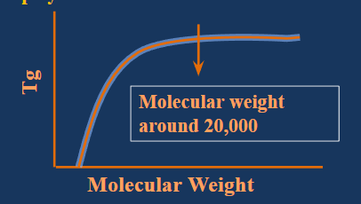
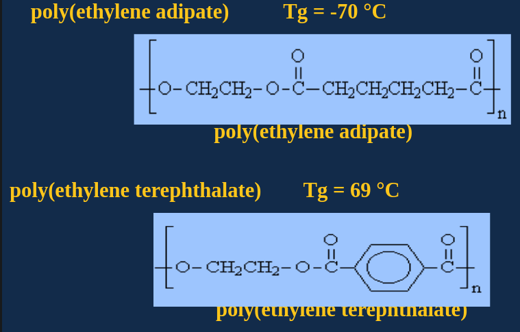
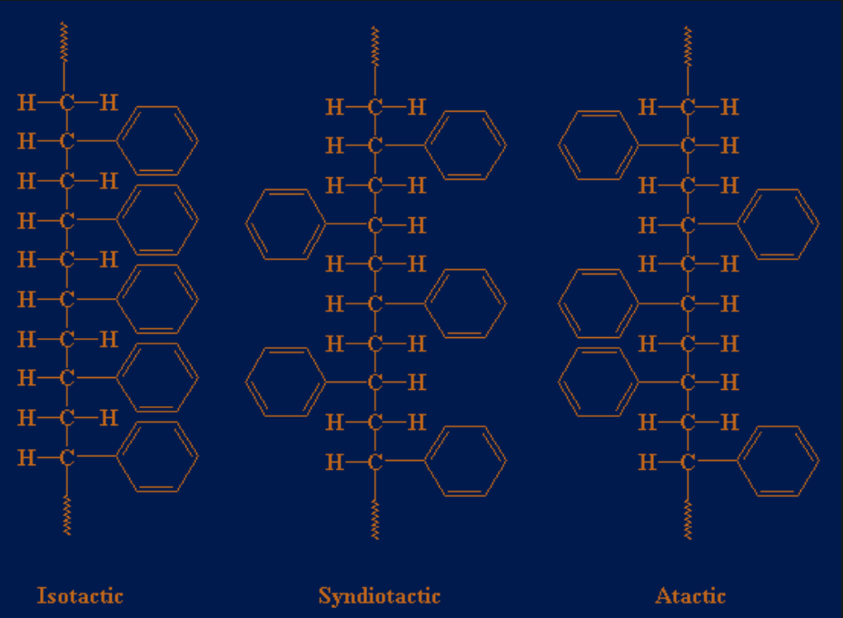
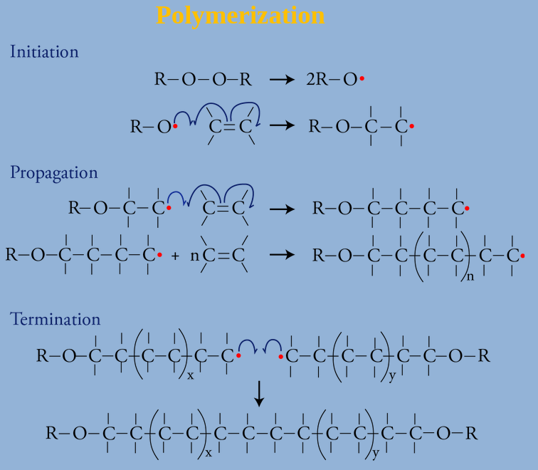

# Macromolecules
- **Definition:** A molecule containing < 100 monomers

# Polymer
- **Greek:** many parts
- **Definition:** A high molecular weight compound formed by the combination of a large number of one or more types of molecules of  low molecular weight. 
- $>$ 100 monomers
- **Examples:** starch, rubber, protein, resins. Polyethylene, PVC

# Monomer
- **Definiton:** A molecule that can react together with other monomer molecules to form a larger polymer chain.
- **Examples:**
  | Polymer      | Monomer                 |
  | ------------ | ----------------------- |
  | Cellulose    | Glucose                 |
  | Polyethylene | Ethylene                |
  | Bakelite     | Phenol and Formaldehyde |

# Polymerization Reaction
- **Definition:** The process of combining a large number of small molecules to form a single macromolecule is known as polymerisation.
## Types
| Addition Polymerisation | Condensation Polymerisation |
|-------------------------|---------|
| **Definition:** Repeated addition of monomers that possess double or triple bonds to form polymers | **Definition:** Repeated condensation reactions between two different  bi-functional or tri-functional monomers |
| Monomers have a double or triple bond. | Bi-functional or tri-functional monomer |
| No by-products | By-products like $NH_3$, $H_2O$ & $HCl$ |
| Results in the addition of monomers | Monomers are condensed |
| Polymer's molecular weight is a multiple of  monomer’s molecular weight | Polymer's molecular weight is not a multiple of the monomer’s molecular weight |
| Lewis acids, Lewis bases, and radical initiators are used as catalysts. | Different molecules are used as catalysts |
| Examples: Polyethylene, Teflon, and PVC | Examples: Bakelite, Nylon and Silicon |
|  |  |


# Repeating Unit
- **Definiton:** Part of  a polymer which can form a polymer chain by repeating themselves and linking together successively along the chain. 
- In Addition Polymerization reaction, monomer $=$ repeating unit
  - Monomer and Repeating unit of polyethylene is    $-CH_2-CH_2-$ 
- In Condensation Polymerization reaction, monomer $\neq$ repeating unit
  - Monomers of nylon-6,6 is Hexadioic acid ($HOOC-(CH_2)_4-COOH$) & 1,6-diamino hexane ($H_2N-(CH_2)_6-NH_2$)\
  Repeating unit is $[-OC-(CH_2)_4-CO-NH-(CH_2)_6-NH- ]$

# Degree of polymerization
- Number of repeating units in the polymer molecule. 
- Degree = molecular weight of a polymer / molecular weight of a repeating unit.
  
# Classification of Polymer
## Origin
**Natural:** Extacted from nature\
Example: Cotton, Silk, Wool, Rubber\
**Synthetic:** Syntesized from monomers\
Example: Polyethylene, PVC, Nylon

## Carbon chain
**Organic:** Backbone essentially made of C\
Example: Almost everything\
**Iorganic:** No C in backbone\
Example: Glass, Silicone rubber

## Heating effect
**Thermoplastic:** Can be melted and molded\
Example: Polythene, PVC, Nylon\
**Thermosetting:** Can't be\
Example: Bakelite

## Backbone
**Homogeneous:** All same atoms in backbone\
Example: Polyethylene\
**Heterogeneous:** Different atoms in backbone\
Example: Polyethylene adipate

## Graphical structure
**Linear:** Each repeating unit is linked with two repeating units on each side\
**Branch:** Mostly linear, with occasional branches\
**Cross-linked:** Branches react and form criss-crossed


## Others
**Plastic:** Can be shaped into hard utility material\
Example: PVC\
**Elastomers:** Exhibits elongation on vulcanization\
Example: Natural, synthetic and silicone rubber\
**Fibre:** Can be fabricated into a filment like material with length equal to 100 times its diameter\
Example: Nylon

# Thermoplastic vs Thermosetting
| Thermoplastic | Thermosetting |
|---------------|---------------|
| **linear/slightly branched** | **cross-linked/heavily branched** |
| **low molecular weight** | **high** |
| **strong, hard and brittle** | **opposite** |
| **soluble in organic solvents** | **not soluble in organic solvents** |
| **addition polymerization** | **condensation polymerization** |
| soften on heating | does not soften on heating | 
| can be remolded | can't be |
| Polythene, PVC, Nylon | Bakelite |

# Glass Transition Temperature
```
↑ Viscofluid state. (Polymer starts to melt and flow) 
.
. Flow temperature(T_f)
.
.
↑
┃
┃ Viscoelastic state (Soft, flexible and rubbery)
┃
┃ Glass Transition Temperature(T_g)
┃
┃ Glassy state (Hard, brittle and glassy)
┃
```

## Factors affecting Glass Transition Temperature
1. **Molecular Weight:**\
   Molecular Weight (< 20K) $\uparrow$ # of chains $\uparrow$ Segmental motion $\downarrow$ $T_G\uparrow$\
   
2. **Chain Stiffness**\
   Stiffness $\uparrow$ Flexibility $\downarrow$ $T_g \uparrow$\
   
3. **Bulky Pedant Groups:**
   Bulky Pedant Groups $\uparrow$ Segmental motion $\downarrow$ $T_G\uparrow$\
   
4. **Flexible Pedant Groups**\
   Flexible pedant groups $\uparrow$ Proximity of Chains $\uparrow$ Segmental motion $\uparrow$ $T_G\downarrow$\
   
5. **Intermolecular Forces:**
   Intermolecular force $\uparrow$ $T_g\uparrow$
   
6. Cross linking
7. Cross linking $\uparrow$ Segmental motion $\downarrow$ $T_g\uparrow$
# Tacticity
- Pedant group = branch of backbone chain
- Tacticity is the type of spatial orientation of pedant groups along the backbone chain
- Physical and chemical properties depend on tacticity
## Types

1. **Isotactic:** All on same side\
   Example: Polypropylene
2. **Syndiotactic:** Arranged in regular, alternating pattern\
   Example: Gutta-percha
3. **Atactic:** Random\
   Example: Polystyrene

# Polymerization


## Initiator
- Initiator reacts with a monomer to form an intermediate compound\
  Initiator + Monomer = Intermediate compound (usually free redicals)
- This intermediate compound is capable of linking successively with a large number of other monomers into a polymeric compound\
  Intermediate compound + n Monomer = Polymer
- Examples: Benzoyl Peroxides, Azobis Isobutyro Nitrile etc. 

## Inhibitors
- Inhibitors are added to monomer to inhibit auto-polymerization
- These are capable of inhibiting the chain  growth by combining with the active free-radicals and forming either stable products or inactive free radicals.
- Examples: Hydroquinone, Nitrobenzene, Dinitrobenzene, Benzothiazine etc
